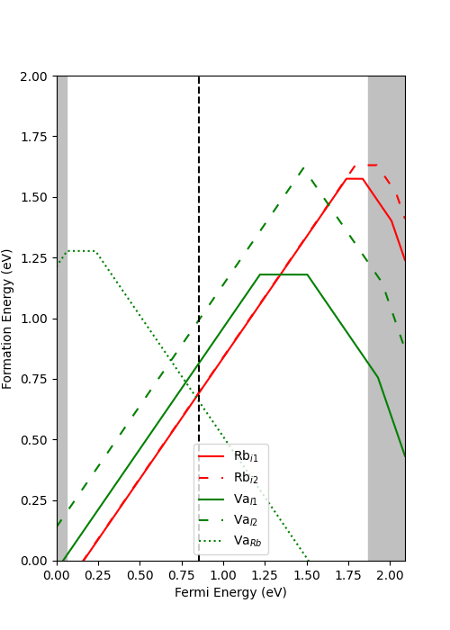

# Charge Defect Analysis

This repository is designed to aid in the preparation of VASP input files for analyzing charge defects in materials. The ultimate goal is to determine the intrinsic Fermi energy at which the system becomes charge neutral.

To fully utilize this repository, you will need to download the script `sxdefectalign`, written by Christopher Freysoldt. This tool is used to calculate correction terms related to the periodic boundary conditions in VASP simulations. It also accounts for the long-range electrostatic potentials assumed to follow a Gaussian distribution.

Another helpful package is `pydefect`, which provides useful tools for determining the chemical potentials of the constituent elements. However, this step can be skipped as long as your potential file follows the same format as shown below.

This package will be useful specifically for interstitials, substitution, and vacancy defects. The genearl format of director names should be as folloes:
added element _ removed element _ charge state.
Here is an example of each defect type:
Vacancy: Va_Rb_0 (neutral charge state)
Substitution: I_Rb_1 (Iodine in a Rubidium Position +1 Charge State)
Interstital: I_i1_-1 (Iodine interstitial in i1 position, this name can be changed, in -1 charge state)

## generate_defects.py
### Description
This script will generate vacancy and substitution defects in a given POSCAR. The location of the defect will be written at the top of the POSCAR file, this is needed fro the sxdefectalign script. This currently does not account for different bonding, it just picks the most central atoms of each type. This script would mostly be useful for terenary materials.
### Input Files
VASP POSCAR (no defects)
## charge_defect_generator.sh
### Description
This script will take neutral charge state defects and generate charge defects from the given files. The script needs to be given the directory name without the charge state. For example for a directory named Va_Rb_0 the input would be Va_Rb. 
### Input Files
Name of Defect and proper directory setup.
## run_sxdefectalign_code.sh
### Description
This script runs the `sxdefectalign` script in each directory where the script is run. This will format all of the bulk energies into one file, get corrections for periodic cell boundries, and generate vatoms files in each directory. This reads the defect location from the neutral charge state POSCAR at the top of the file as shown in the generate_defects.py script.
### Input Files
This will need the dielctric tensor of the material, the location of the bulk (non-defected) LOCPOT file, the location of sxdefectalign script on terminal/pc, and a properly formatted directory with LOCPOTs for each defect..
## make_vatoms_output.sh
### Description
This script gets the data from all of the vatoms files generated by sxdefectalign and format it into one file. 
### Input Files
Needs vatom file in each directory.
## complete_def_en_ef_min.py
### Description
Using the files above this script will determine the correction values due to the difference between the assumed charge potential by VASP compared to the actaul values. Using all of the correction values and inputted values the charge neutrality of the system will be analyzed and the intrinisc fermi energy will be determined.
### Input Files
This will need the vAtoms_output.csv, energies_correction.csv, target_verticies.yaml, and a POSCAR which will contain the number of locations of each "defect". I have an example in the repository but to privide further detail you would write into the POSCAR the number of positions of one iodine bonding position or open interstitial position etc. The target_verticies.yaml file should contain any chemical potentials with same names used as your directories. So, if you have multiple locations of Iodine and the positions are named I1, I2, I3, etc. each one should have a value in the yaml file.

The run command for this file would look like:
python complete_def_en_ef_min.py bandgap_value vbm_value (from EIGENVAL) I1 I2 I3 Rb Sb... (bulk energies per atom of each element I1 and I2 will be the same in this case)

There are additional tags that can be seen by using:
python complete_def_en_ef_min.py -help
### Sample Plot

